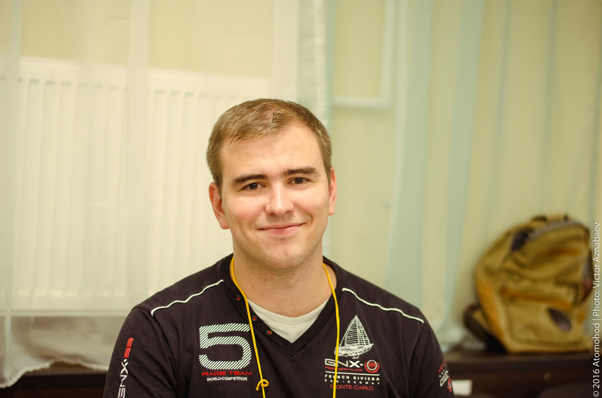

# one-man-bank-architecture

### В этом репозитории будут собраны архитектурные артефакты для построения one-man-bank о этапах которого буду повествовать в telegram канале talismanovIT

### Задача данного репозитория проектировать и документировать предстоящие работы, а самое главное попытаться воплотить их руками
[телеграм канал talismanovIT](https://t.me/talismanovIT)

## Структура:
- [0 Глоссарий](0_glossary%2Fglossary.md)
- [1 Бизнес цели](1_business-goals%2Fbusiness-goals.md)
- [2 Требования](2_requirements/requirements-template.md)
- 3 Стратегия
  - [3.1 Бизнес возможности](3_strategy%2Fbusiness-capabilities.md)
  - [3.2 Связь Бизнес-целей и бизнес возможностей](3_strategy%2Fbusiness-goals-to-capabilities-mapping.md)
  - [3.3 Цепочка добавления ценности (Value Stream)](3_strategy%2Fvalue-stream.md)
- [4 Архитектурные слои ландшафта банка (DRAFT)](4_architectural_layout%2Farch_layout.md)
- 5 Архитектурные решения
  -  [SAD-001 Архитектура решения по Депозитным продуктам](solutions%2FSAD-001-deposits%2Fdeposits-sad-epic001.md)
- TBD

## Наша команда:
-  CEO Талисманов Александр (Russia)
-  CTO Talismanov Aleksandr (US)
-  Chief Architect Талисмани Александър (Buglaria) 
-  Head of Development Tılsımov İskender (Turkey)
-  Junior Go Developer Талисманов Аляксандр (Belarus) 
-  Junior Python Developer Talismanov Alexandre (Brazil)