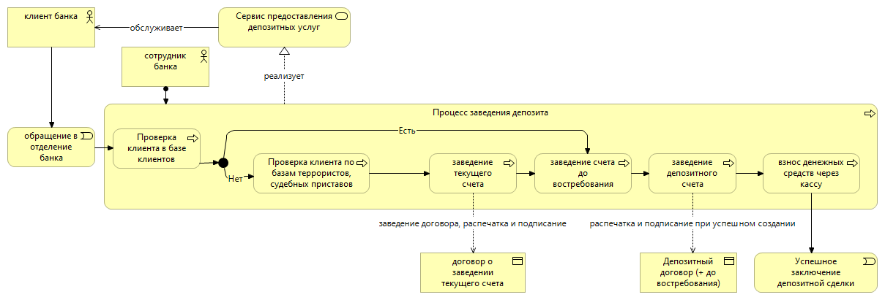

### SAD-001 Архитектура решения по Депозитным продуктам

## Бизнес-требования:
  * возможность открыть срочный вклад в рублях на сроки 1 мес, 3 мес, 6 мес и 1 год без частичного снятия (напокительные вклады 2ой этап)
  * перечисление накопленных процентов на текущий счет (капитализация второй этап, после выхода на рынок)
  * возможность закрытия вклада
  * возможность открывать вклады до востребования
  ссылка на эпик ([EPIC-001.DEPOSIT.md](..%2F..%2F2_requirements%2FEPIC-001.DEPOSIT.md))

* Технические требования
* Области применения архиктуры (какие продукты, каналы, аудитория, геораспредленность, бизнес процессы, нормативные требования, а также технологии, системы, внешние системы, стандарты безопасности)
* Пользователи
* Архитектурные принципы

## Бизнес-процессы
