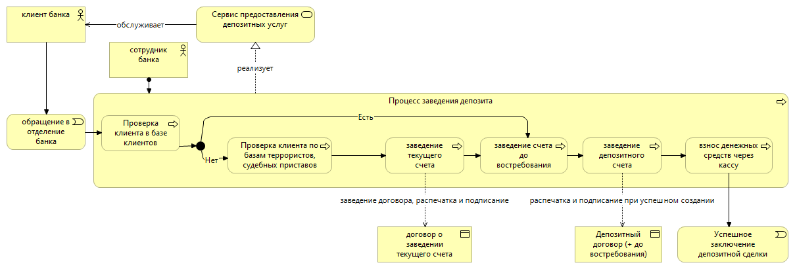
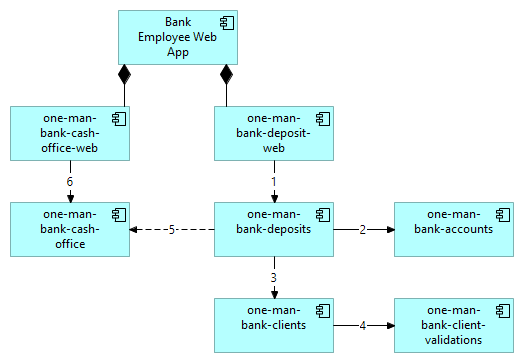
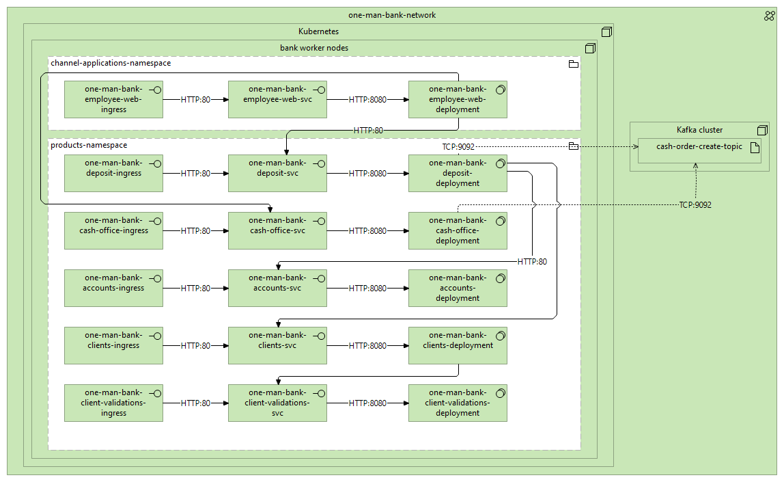
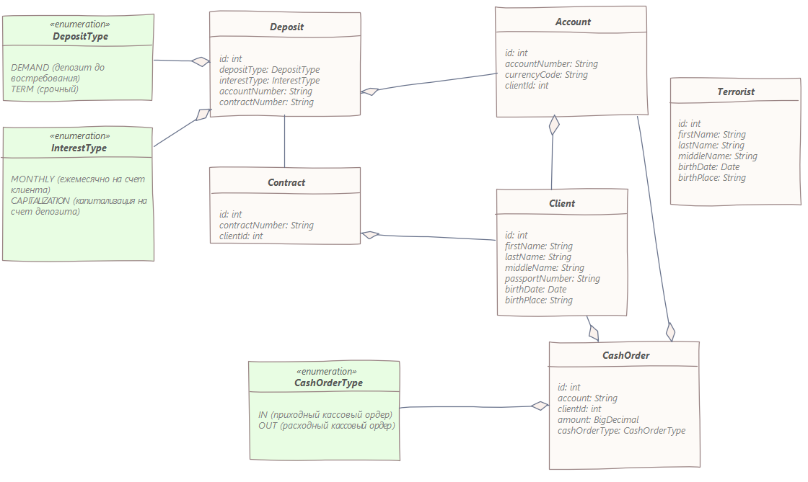

### SAD-001 Архитектура решения по Депозитным продуктам

## [1. Глоссарий](../../0_glossary/glossary.md)

## 2. Бизнес-требования (ФТ):

* возможность открыть срочный вклад в рублях на сроки 1 мес, 3 мес, 6 мес и 1 год без частичного снятия (напокительные
  вклады 2ой этап)
* перечисление накопленных процентов на текущий счет (капитализация второй этап, после выхода на рынок)
* возможность закрытия вклада
* возможность открывать вклады до востребования
  ссылка на эпик ([EPIC-001.DEPOSIT.md](../../2_requirements/EPIC-001.DEPOSIT.md))

## 3. Технические требования (НФТ)

TODO

## 4.1. Бизнес-процессы

## 4.2. Шаги процесса (Sequence diagrams)

TODO

## 5.1 Схема взаимодействие систем/сервисов уровень приложений (Application Layer)

## 5.2 Схема развертывания. Инфраструктурный уровень (Technology Layer)

## 6 Модель данных

### ЛМД DRAFT

### Маппинг сущностей на сервисы

| Cущность  | Сервис                          |
|-----------|---------------------------------|
| Deposit   | one-man-bank-deposits           |
| Contract  | one-man-bank-deposits           |
| Account   | one-man-bank-accounts           |
| Terrorist | one-man-bank-client-validations |
| Client    | one-man-bank-clients            |
| CashOrder | one-man-bank-cash-office        |

## 7 Области применения архиктуры (какие продукты, каналы, геораспредленность, бизнес процессы, нормативные требования, а также технологии, системы, внешние системы, стандарты безопасности)

TODO

В данном решении должен быть реализован 1 канал. Вэб приложение.

## 8 Пользователи

* Сотрудники бэк-офиса
* Администраторы (2ой этап)

## 9 ADRы

[ADR-001.Выбор архитектуры](../../adrs/ADR-001.md)
TODO оформить, как отдельные артефакты последующие ADRы

## N Остальные разделы

TODO